# DENKEN-OS ドキュメント体系

電験二種の合格を「再現性のある学習プロセス」に体系化するプロジェクト DENKEN-OS の、
**情報発信戦略・調査結果・自動化の実装指示**をまとめたドキュメント一式。

このセッションでの検討（調査→戦略→評価→ロードマップ→実装指示）を、後から再利用できる形で保存している。

---

## 全体像

```
docs/
├── strategy/     戦略の素地・調査結果・評価・ロードマップ（"なぜ・何を"）
│   ├── 00-overview.md        コンセプト（凡人成り上がり）＋成長ループ＋図解
│   ├── 01-roadmap.md         マスターロードマップ＋90日ズーム＋週次エンジン
│   ├── 02-evaluation.md      82/100の診断・スコアカード・構造的天井・90+への道
│   ├── 03-quality-hardening-plan.md 品質ゲートの根本原因対策と次バックログ
│   ├── exam-structure.md     ★試験構造（科目/配点/合格基準）＋学習科学に基づく学習法
│   ├── human-tasks.md        人間タスク チェックリスト（締切/委任/承認ゲート）
│   └── ideas/                深掘り調査:アイデア計900（9テーマ×100）
│       ├── 01-branding-positioning.md   ブランド/発信の全体像 100
│       ├── 02-app-growth.md             学習アプリ成功のための発信 100
│       ├── 03-x-tactics.md              X特化の攻略 100
│       ├── 04-100point-fixes.md         100点化:問題点の根本原因＋100の対策
│       ├── 05-deep-audit-2026-06.md     コードベース深掘り監査 100
│       ├── 06-exam-mastery-100.md       ★合格力に直結する学習エンジン強化 100
│       ├── 07-figures-explanations-100.md ★図式と解説（電験王のような図解）100
│       ├── 08-ui-design-100.md          ★UI/UXデザイン洗練 100
│       └── 09-secondary-exam-mastery-100.md ★二次試験対策の深化（記述・部分点）100
│
├── x-strategy/   X発信の運用パッケージ（"どう動かすか"・コピペ可）
│   ├── README.md             索引＋スコアカード＋5つの根本原因＋30日プラン
│   ├── 01-positioning.md     ペルソナ／プロフ・固定ポスト文案
│   ├── 02-content-engine.md  「今日の一問」エンジン／クイズ二段運用
│   ├── 03-quality-pipeline.md 検算・人の目チェック・誤り訂正SOP
│   ├── 04-compliance.md      著作権／出典・改題テンプレ
│   ├── 05-engagement-algorithm.md 2026アルゴリズム適合／リプ営業SOP
│   ├── 06-moat-community.md  関係性を堀に／コミュニティ立ち上げ
│   ├── 07-monetization-failure-hedge.md 収益ブリッジ／不合格ヘッジ
│   ├── 08-sustainability-kpi.md スコープ削減／バッチ運用／KPI
│   ├── 09-anti-slop.md      脱Slop＆RTされる質／Grok対策
│   └── templates/            投稿テンプレ／問題スキーマ／検証済みサンプル／カレンダー
│
└── automation/   自動化の実装指示（"作るときの仕様"・未実装）
    ├── README.md             全自動化領域の索引＋横断原則＋着手順
    └── 01〜12                 各自動化領域のタスク仕様
```

## 自動化パイプライン全体図（II-198）

生成→検証→配信→集計→改善の循環ループ。

```mermaid
flowchart LR
    subgraph generate["① 生成（lib/engine/）"]
        T["templates/*.ts\n88テンプレ（決定論ソルバ）"]
        G["generate.ts\ngenerateOne / attemptsUsed"]
        N["narrate.ts\n解説言い回し（Claude API or stub）"]
        T --> G --> N
    end

    subgraph validate["② 検証（lib/engine/ + scripts/）"]
        V["validate.ts\nvalidateProblem / validatePhysics\nvalidateProblemSet"]
        AJV["validate-problems.ts\nproblem-schema.json（ajv）"]
        SD["schema-drift.test.ts\nzod ↔ ajv ドリフト検知"]
        N --> V --> AJV
        AJV -.->|drift check| SD
    end

    subgraph build["③ 配信（scripts/ + CI + web/）"]
        BP["build-problems.ts\nnpm run build:problems\n→ web/problems.json（788問）"]
        BW["build-web.ts\nesbuild → web/dist/app.js\nSRI sha384 埋込"]
        CI["validate.yml\nlint → typecheck → test → build\nバンドルサイズバジェット\nGITHUB_STEP_SUMMARY"]
        SW["sw.js v20\nService Worker\nオフラインキャッシュ"]
        AJV --> BP --> BW --> SW
        BW --> CI
    end

    subgraph app["④ 学習アプリ（web/）"]
        APP["app.ts → router.ts\n7タブ SPA（PWA・オフライン）"]
        STATE["state/\npractice / exam / app"]
        CACHE["xpByDayCached\nbyTopicCached\nevaluateAchievementsCached"]
        SW --> APP --> STATE
        STATE --> CACHE
    end

    subgraph collect["⑤ 集計（lib/aggregate/ + supabase/）"]
        LOG["answer_logs\n（localStorage / Supabase RLS）"]
        AGG["aggregate.ts\n正答率・最頻誤答・難易度提案"]
        DIAG["diagnosis.ts\nweaknessScore・getScheduler()"]
        STATE --> LOG --> AGG --> DIAG
    end

    subgraph improve["⑥ 改善（lib/ingest/ + lib/chat/）"]
        ING["ingest.ts + parseCitation()\n過去問取込・出典フォーマット強制"]
        KNOW["knowledge.ts\nKNOWLEDGE_META（RAG 知識ベース）"]
        DIAG -->|弱点フィードバック| ING
        ING --> T
        KNOW --> APP
    end
```



> **挙動不変の原則**: `web/problems.json` のバイト列・localStorage キー・Supabase テーブル構造は
> リファクタ（RG1〜RG7）を通じて不変。`git diff --exit-code web/problems.json` でゼロ差分を CI が確認。

## 読む順番（おすすめ）

1. `strategy/00-overview.md` … 何を目指すか（コンセプトと図解）
2. `strategy/exam-structure.md` … ★試験の科目/配点/合格基準＋学習科学に基づく学習法
3. `strategy/01-roadmap.md` … いつ何をやるか（行程）
4. `strategy/02-evaluation.md` … どこに弱点があり、どう埋めるか（率直な評価）
5. `strategy/ideas/06-exam-mastery-100.md` … ★学習エンジンの根本改善100（合格力直結）
6. `strategy/03-quality-hardening-plan.md` … リポジトリ品質ゲートの根本原因対策
7. `x-strategy/README.md` … 実際の運用（コピペで動かせる）
8. `automation/README.md` … 作るときの実装指示
9. `strategy/ideas/` … 元になった調査の全アイデア（idea bank）

## 一行サマリ

> 「解説者(権威)」ではなく **「当事者の記録 × 道具づくり × 共闘」** で立つ。
> 凡人が電験二種に挑むサクセスストーリーを軸に、「今日の一問」をエンジンとして
> 学習アプリ DENKEN-OS の成長へ繋げる。アプリは無料で配って仲間を集め、課金は信頼が溜まってから。

## 出典・調査について

各ドキュメント内に、根拠とした一次情報・記事へのリンクを記載している。
主な調査領域: 2026年版Xアルゴリズム、電験過去問の著作権、生成AIのハルシネーション対策、
クイズ型エンゲージメント、PLG/ASO/バイラル、Community-Led Growth、FSRS、X自動化ポリシー。
