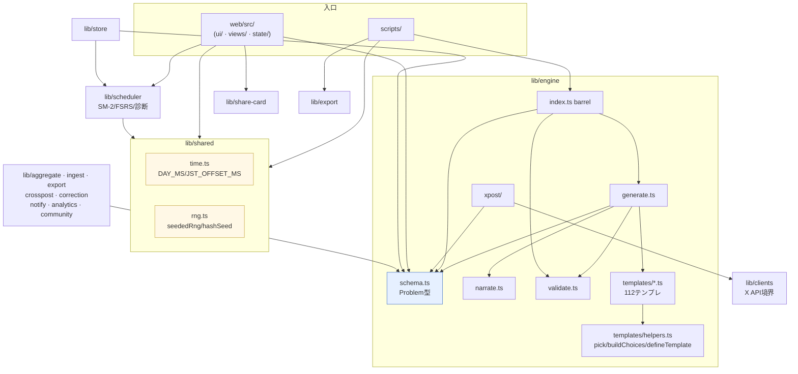

# アーキテクチャ

`denken-os` のモジュール構成・依存関係・データフローを俯瞰する。
個別仕様は [`docs/automation/`](automation/README.md)、各モジュールの責務一覧は
[`lib/README.md`](../lib/README.md) を参照。

## レイヤ構成

```
┌─────────────────────────────────────────────────────────────────────┐
│  入口 (entrypoints)                                                  │
│  scripts/ … gen / export:vault / validate:data / build:web / 他     │
│  web/src/ … オフライン学習アプリ (PWA)                               │
└───────────────┬─────────────────────────────────────────────────────┘
                │ import
┌───────────────▼─────────────────────────────────────────────────────┐
│  共有ユーティリティ (lib/shared/)                                    │
│    time.ts … DAY_MS / JST_OFFSET_MS（lib 全体・web 双方で共有）     │
│    rng.ts  … seededRng / hashSeed（決定論 RNG・ビット互換）          │
└───────────────┬─────────────────────────────────────────────────────┘
                │ import
┌───────────────▼─────────────────────────────────────────────────────┐
│  ドメインロジック (lib/)                                             │
│                                                                      │
│   engine/ ── 問題生成 & 検証の中核                                   │
│     ├ schema.ts ……… Problem 型 = 全モジュール共通言語               │
│     ├ generate / narrate / validate / gate / clean                   │
│     ├ templates/                                                      │
│     │   ├ helpers.ts … 共有ヘルパー（pick / buildChoices /           │
│     │   │               percentage / ensureRange / defineTemplate）   │
│     │   └ <topic>.ts … 科目別の決定論ソルバ（112テンプレ）           │
│     └ xpost/ … X投稿パイプライン (toXPost / xlength / publish)       │
│   engine/index.ts … barrel（単一入口）                               │
│                                                                      │
│   scheduler/ … SM-2 + FSRS + 弱点診断 (独立)                        │
│   store/ ……… 永続化 (memory / file / Supabase)                     │
│   aggregate / ingest / export / crosspost /                          │
│   correction / notify / analytics / community / share-card           │
│   clients/ … 外部I/O境界 (X API は既定で下書きエクスポート)          │
└──────────────────────────────────────────────────────────────────────┘

web/src/ の構成（G6 リファクタ後）:

    app.ts          — エントリポイント（90行）
    app-init.ts     — problems.json 読込
    keyboard.ts     — グローバルキーボードハンドラ
    ui/             — DOM ヘルパー・トースト・共通ウィジェット
    views/          — タブ別画面（router + practice/review/exam/chat/dashboard/formulas/settings）
    state/          — 画面別 typed 状態（app/exam/practice）
    dates.ts        — JST 日付ユーティリティ（lib/shared/time.ts の web 側対応）
    sanitize.ts     — SVG サニタイザ
    その他ロジック: xp / quests / freeze / achievements / grade / select / mathfmt 等
```

## モジュール依存グラフ

`engine/schema.ts` が定義する `Problem` 型が全体の共通言語（lingua franca）であり、
ほとんどのモジュールはこれに依存する。逆に `engine` は外部I/O境界の `clients` 以外の
ドメインモジュールには依存しない（依存の向きが一方向＝循環なし）。

`lib/shared/` は `lib/` 全体と `web/src/` の双方が参照する共有層。
依存の向きは常に「入口 → shared/ドメイン → engine/schema」であり循環はない。



## 設計上の不変条件

リポジトリの中核的な品質保証ロジック。変更時はこれらを壊さないこと。

1. **正解はLLMに出させず、コードで決定論的に算出する。**
   `engine/templates/` の各ソルバが数値を計算し、LLM(`narrate.ts`)は言い回しのみ担当。
   生成後に解説中の数値とソルバ値を照合し、不一致は破棄（ハルシネーション根本対策）。
   → `ANTHROPIC_API_KEY` が無ければ決定論スタブで動作し、数値は同一。

2. **スキーマの二重定義はドリフトをテストで検知する。**
   実行時検証は `engine/schema.ts`（zod）、CI/外部配布用は
   `docs/x-strategy/templates/problem-schema.json`（JSON Schema / ajv）。
   両者の乖離は `tests/engine/schema-drift.test.ts` で検出する
   （設計判断の詳細は [`docs/adr/0001-dual-schema-validation.md`](adr/0001-dual-schema-validation.md) を参照）。

3. **外部への副作用は境界(`clients/`)に隔離し、既定は下書きエクスポート。**
   X実投稿は無料API枠廃止・凍結回避のため `DraftExportClient` が既定。
   実投稿/永続化(Supabase)の実体は認証取得後にアダプタを差し替える
   （[`docs/strategy/human-tasks.md`](strategy/human-tasks.md)）。

4. **依存の向きは一方向。** ドメインモジュール → `engine/schema`(型) の向きのみ。
   `engine` はドメイン他モジュールに依存しない。循環依存を作らない。

## ESM とビルド

- `lib/` は **ESMの `.js` 拡張子付き import** を用いる（Node ネイティブESM互換・ツール非依存）。
  この移植性を保つため、あえてパスエイリアスは導入していない。
- Web アプリは `scripts/build-web.ts`（esbuild）で単一バンドル化する。
  `.js` 指定を実在 `.ts` に解決する小さなプラグインを噛ませている。

## web/src 実行フロー（RG6 リファクタ後・II-195）

`web/src/app.ts` の `main()` 起動から view dispatch・state mutation までの制御フロー。

```mermaid
flowchart TD
    A["app.ts main()
    ①テーマ適用 applyTheme()
    ②お守りブリッジ runFreezeBridge()
    ③イベントリスナ登録（visibilitychange/beforeinstallprompt）
    ④グローバルエラーハンドラ"] --> B["app-init.ts
    reloadProblems()
    — problems.json fetch → state/app.problems"]
    A --> C["views/router.ts renderNav()
    WAI-ARIA tablist を DOM に生成"]
    B --> D["views/router.ts render()"]

    D --> E{"view（タブ識別子）"}
    E -->|practice| F["views/practice.ts renderPractice(root)"]
    E -->|review|   G["views/review.ts renderReview(root)"]
    E -->|exam|     H["views/exam.ts renderExam(root)"]
    E -->|chat|     I["views/chat.ts renderChat(root)"]
    E -->|dashboard|J["views/dashboard.ts renderDashboard(root)"]
    E -->|formulas| K["views/formulas.ts renderFormulas(root)"]
    E -->|settings| L["views/settings.ts renderSettings(root)"]

    D -->|per-view エラー境界 II-162| M["errors.ts recoveryView()
    — role=alert 復旧 UI"]

    F --> N["state/practice.ts
    combo / hints / answered
    setter で差分更新（II-174）"]
    H --> O["state/exam.ts
    timerId（clearExamTimer で一元管理 II-156）
    残時間・問題インデックス"]

    F --> P["xp.ts xpByDayCached()
    byTopicCached() — メモ化 II-143/144"]
    J --> P
    J --> Q["achievements.ts evaluateAchievementsCached()
    ログ追記時のみ差分再評価 II-145"]

    D --> R["ui/dom.ts h() / $req()
    SafeHtml branded type
    — XSS 防止 II-169/170"]
    D --> S["ui/toast.ts showToast()
    aria-live=assertive で SR 告知 II-158"]

    style M fill:#fdd,stroke:#c44
    style R fill:#e6f0ff,stroke:#4a78c8
    style S fill:#e6f0ff,stroke:#4a78c8
```

### タブ切替シーケンス

```
ユーザー操作 → switchView(id)
  → clearExamTimer()          // タイマーリーク防止（II-156）
  → state/app.setView(id)     // view 識別子を更新
  → renderNav()               // aria-selected を更新
  → render()                  // 新タブの view 関数を呼出
      → root.replaceChildren()  // aria-busy=true（II-157）
      → renderViewSafe(root, id, fn)   // per-view エラー境界
      → root.setAttribute("aria-busy","false")
```

### RG1〜RG7 で変化した主な構造

| Wave | タスク | 追加・変更されたモジュール |
|------|--------|--------------------------|
| Wave 1 | RG1 | `lib/engine/templates/helpers.ts`（`constrainRange`/`isNonNegative`）`lib/shared/constants.ts`（`POWER_FACTOR_TOLERANCE`） |
| Wave 1 | RG2 | `lib/engine/schema.ts`（source discriminated union・`rejection_reason`）`lib/engine/validate.ts`（`validatePhysics`/`validateProblemSet`）`lib/engine/generate.ts`（`attemptsUsed`・テレメトリ） |
| Wave 1 | RG3 | `lib/engine/cli.ts`（`-t`/`-v`/`--version`/`--xpost-limit`/`--xpost-out`）`lib/engine/figures/primitives.ts`（共通プリミティブ） |
| Wave 1 | RG4 | `lib/scheduler/index.ts`（`getScheduler`）`lib/scheduler/sm2.ts`（SM-2 Wozniak1990 根拠・`createdAtMs`）`lib/store/`（lenient モード）`lib/ingest/`（`parseCitation`）`lib/chat/knowledge.ts`（`KNOWLEDGE_META`） |
| Wave 2 | RG5 | `web/src/xp.ts`（`xpByDayCached`）`web/src/dashboard.ts`（`byTopicCached`）`web/src/achievements.ts`（`evaluateAchievementsCached`）`web/src/state/practice.ts`（setter） |
| Wave 2 | RG6 | `web/src/views/exam.ts`（`clearExamTimer`）`web/src/views/router.ts`（per-view エラー境界・`aria-busy`）`web/src/ui/dom.ts`（`$req`/`SafeHtml`）`web/src/ui/safe-html.ts` |
| Wave 2 | RG7 | `web/index.html`（CSP/SRI）`web/sw.js`（v20・自動版数）`supabase/migrations/0004_rls_fk_notnull.sql`（RLS/FK/NOT NULL）`tests/integration/`（統合テスト）CI バジェット |

## 検証パイプライン

`npm run verify`（CI `.github/workflows/validate.yml` の主要ゲートのサブセット。プリプッシュ確認に使う。
CI はさらに npm audit・生成物鮮度 diff・カバレッジ閾値を検証する）:

```
lint (Biome) → typecheck (lib/scripts/tests) → typecheck:web
  → validate:data (ajv + JSON Schema) → test (vitest・カバレッジ閾値は vitest.config.ts の thresholds が正)
  → build:web (esbuild → web/dist/)
```

CI はアーティファクトとして `coverage/`（7日保存）と `web/dist/`（成功時のみ）を保存する。
カバレッジサマリーは `GITHUB_STEP_SUMMARY` にも出力される。

タグ (`v*`) push 時は `release.yml` が `release:check`（verify + audit strict）を実行し、
GitHub Release 草稿を自動作成する（`gh release create --draft`）。

## スクリプトフラグ

主なスクリプトは `--help` で使用方法を表示できる:

| スクリプト | 主なフラグ |
|---|---|
| `npm run build:problems` | `--per-topic <N>`（1トピック当たり問題数・既定300）, `--help` |
| `npm run gen` | `--topic`（`-t`）, `--count`, `--seed`, `--xpost`, `--xpost-limit <N>`, `--xpost-out <path>`, `--version`（`-v`）, `--help`（`-h`） |
| `npm run validate:data` | `--help` |
| `npm run audit:status` | `--strict`, `--help` |
| `npm run export:vault` | `--out <dir>`, `--help` |

スクリプト間共通の原子的書き込み（tmp+rename）は `scripts/shared.ts` の
`atomicWriteFileSync` が担い、途中クラッシュによる半端ファイルを防止する。
