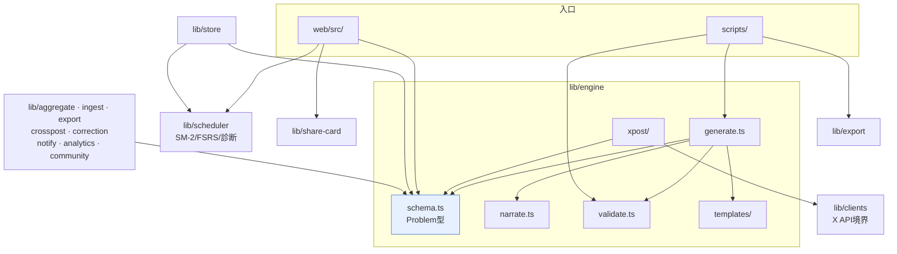

# アーキテクチャ

`denken-os` のモジュール構成・依存関係・データフローを俯瞰する。
個別仕様は [`docs/automation/`](automation/README.md)、各モジュールの責務一覧は
[`lib/README.md`](../lib/README.md) を参照。

## レイヤ構成

```
┌─────────────────────────────────────────────────────────────┐
│  入口 (entrypoints)                                          │
│  scripts/ … gen / export:vault / validate:data / build:web   │
│  web/src/ … オフライン学習アプリ (PWA)                       │
└───────────────┬─────────────────────────────────────────────┘
                │ import
┌───────────────▼─────────────────────────────────────────────┐
│  ドメインロジック (lib/)                                     │
│                                                              │
│   engine/ ── 問題生成 & 検証の中核                           │
│     ├ schema.ts ……… Problem 型 = 全モジュール共通言語        │
│     ├ generate / narrate / validate / gate / clean           │
│     ├ templates/ … 科目別の決定論ソルバ                      │
│     └ xpost/ … X投稿パイプライン (toXPost / xlength / publish)│
│                                                              │
│   scheduler/ … SM-2 + FSRS + 弱点診断 (独立)                 │
│   store/ ……… 永続化 (memory / file / Supabase)              │
│   aggregate / ingest / export / crosspost /                  │
│   correction / notify / analytics / community / share-card   │
│   clients/ … 外部I/O境界 (X API は既定で下書きエクスポート)  │
└──────────────────────────────────────────────────────────────┘
```

## モジュール依存グラフ

`engine/schema.ts` が定義する `Problem` 型が全体の共通言語（lingua franca）であり、
ほとんどのモジュールはこれに依存する。逆に `engine` は外部I/O境界の `clients` 以外の
ドメインモジュールには依存しない（依存の向きが一方向＝循環なし）。



## 設計上の不変条件

リポジトリの中核的な品質保証ロジック。変更時はこれらを壊さないこと。

1. **正解はLLMに出させず、コードで決定論的に算出する。**
   `engine/templates/` の各ソルバが数値を計算し、LLM(`narrate.ts`)は言い回しのみ担当。
   生成後に解説中の数値とソルバ値を照合し、不一致は破棄（ハルシネーション根本対策）。
   → `ANTHROPIC_API_KEY` が無ければ決定論スタブで動作し、数値は同一。

2. **スキーマの二重定義はドリフトをテストで検知する。**
   実行時検証は `engine/schema.ts`（zod）、CI/外部配布用は
   `docs/x-strategy/templates/problem-schema.json`（JSON Schema / ajv）。
   両者の乖離は `tests/engine/schema-consistency.test.ts` で検出する。

3. **外部への副作用は境界(`clients/`)に隔離し、既定は下書きエクスポート。**
   X実投稿は無料API枠廃止・凍結回避のため `DraftExportClient` が既定。
   実投稿/永続化(Supabase)の実体は認証取得後にアダプタを差し替える
   （[`docs/strategy/human-tasks.md`](strategy/human-tasks.md)）。

4. **依存の向きは一方向。** ドメインモジュール → `engine/schema`(型) の向きのみ。
   `engine` はドメイン他モジュールに依存しない。循環依存を作らない。

## ESM とビルド

- `lib/` は **ESMの `.js` 拡張子付き import** を用いる（Node ネイティブESM互換・ツール非依存）。
  この移植性を保つため、あえてパスエイリアスは導入していない。
- Web アプリは `scripts/build-web.ts`（esbuild）で単一バンドル化する。
  `.js` 指定を実在 `.ts` に解決する小さなプラグインを噛ませている。

## 検証パイプライン

`npm run verify`（= CI `.github/workflows/validate.yml` と同一手順）:

```
lint (Biome) → typecheck (lib/scripts/tests) → typecheck:web
  → validate:data (ajv) → test (vitest) → build:web (esbuild)
```
