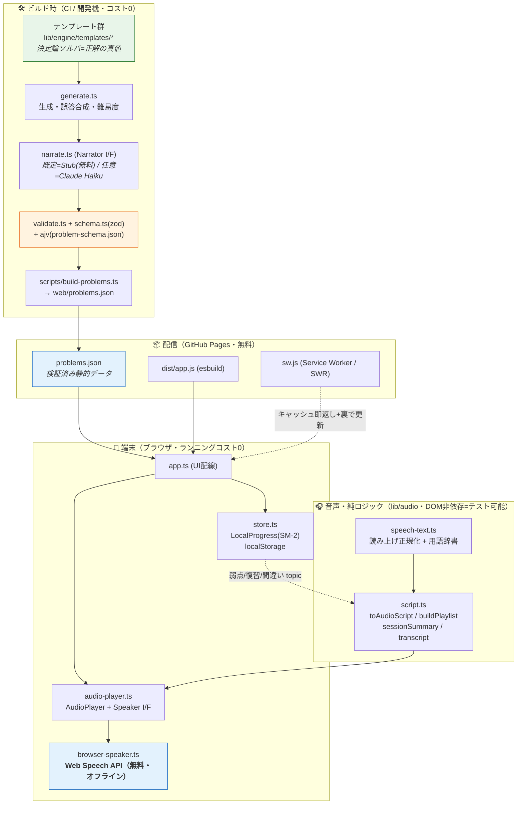
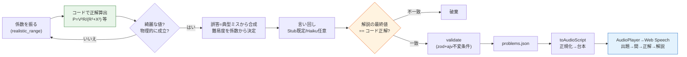
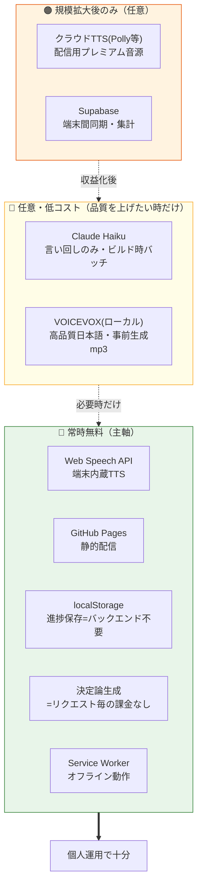
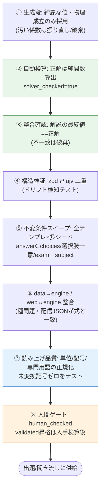
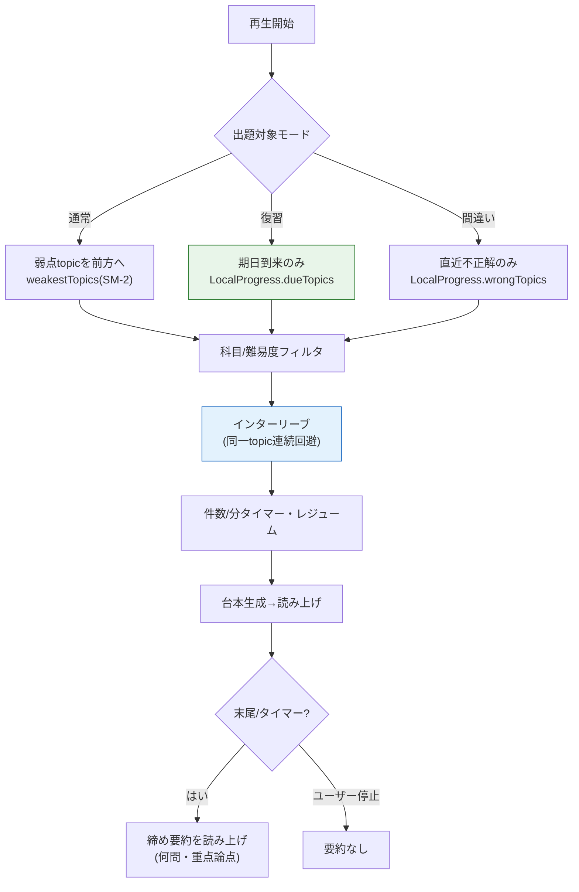
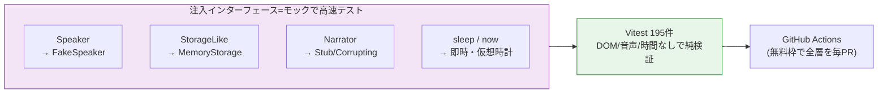
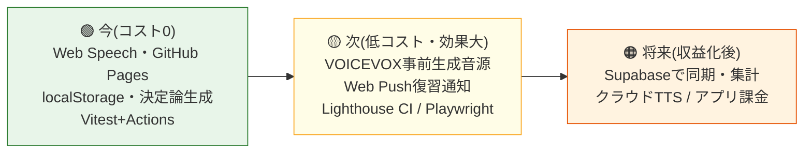
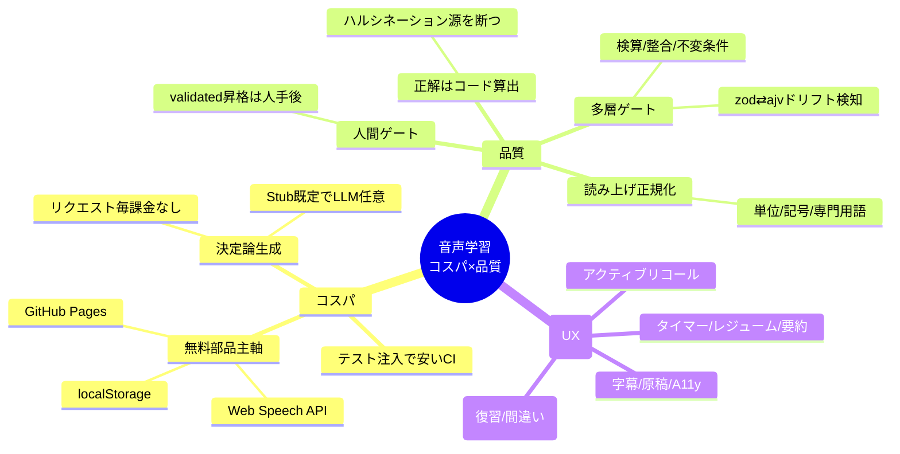

# 図解: 音声学習システムの全体像（コスパ × 品質保証）

> DENKEN-OS の「法規 聞き流し」を、**コスト最小**かつ**品質を多層で担保**する形に組んだ全体像。
> 図は Mermaid（GitHub でそのまま描画）。実装ファイルと対応づけてある。
>
> 二大原則:
> 1. **正解はコードで算出**（LLM/外部APIに数値を作らせない）＝ ハルシネーション源を断つ。
> 2. **無料・オフライン部品を主軸**（Web Speech API / GitHub Pages / localStorage）＝ ランニングコストほぼ0。

---

## 1. 全体アーキテクチャ（レイヤと依存）

ポイント: **コストが発生しうるのはビルド時の任意LLM言い回しのみ**（しかも Haiku＋既定はStubで0）。実行時は完全に無料部品。

---

## 2. データフロー（1問が耳に届くまで）

---

## 3. コスト構造（なぜ安いか）

| 項目 | 主軸（無料） | コスト発生条件 |
|---|---|---|
| 音声合成 | Web Speech API | クラウドTTSを選んだ時のみ |
| ホスティング | GitHub Pages | 独自ドメイン/大規模配信時のみ |
| 問題生成 | 決定論コード（Stub） | Haiku言い回しを使う時のみ（1回/問・ビルド時） |
| 進捗/同期 | localStorage | 端末間同期が必要になったら Supabase |

---

## 4. 品質保証の多層ゲート（事故率を下げる）

各層は CI（GitHub Actions・無料枠）で自動実行。**品質コストもほぼ0**で、回帰を機械的に止める。

---

## 5. 再生順の決定（SRS連携・聞き流しの賢さ）

---

## 6. テスト容易性（品質を安く保つ設計）

DOM・実音声・実時間を**注入で差し替え**るため、CI は速く・無料枠で完結。＝**品質保証の運用コストが低い**。

---

## 7. 段階的コスト戦略（今 → 次 → 将来）

---

## まとめ：コスパと品質の両立ロジック

**設計の要諦**: 「お金がかかる部分（正確な計算・自然な音声）を、お金のかからない方法（決定論コード・端末内蔵TTS）で代替し、品質はコードと自動テストで機械的に担保する」。これにより**個人運用でランニングコストほぼ0**のまま、資格問題に必須の正確性を維持する。
