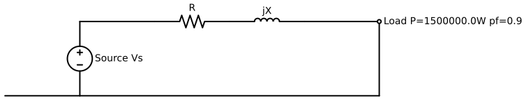
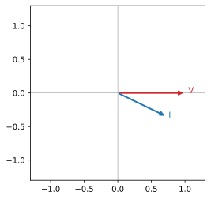

# 三相3線式送電線の電圧降下

## 問題

定格周波数の三相3線式送電線がある。受電端の線間電圧 6600 V、負荷の有効電力 1500000 W、 力率 0.9(遅れ)であり、1線当たりの抵抗 R = 1.5 Ω、リアクタンス X = 6.5 Ω である。 受電端電圧を基準とした近似式により、線間電圧降下 Vd[V] を求めよ。

*図1 三相送電線の単線図(1線分の R, X)*

*図2 受電端電圧 V を基準とした電流 I のフェーザ図(遅れ力率)*

## 解答

1. $ sinphi = \sqrt{1 - pf^{2}} = 0.4359 $
2. $ I = \frac{\sqrt{3} P}{3 Vr pf} = 145.8 $
3. $ Vd = \sqrt{3} I \left(R pf + X sinphi\right) = 1056.0 $
4. $ Vs = Vd + Vr = 7656.0 $

> [!success] 答え
> 1060 V

## 採点基準

| 観点 | 配点 |
|---|---|
| 受電端電流 I = P/(√3·V·cosφ) の立式 | 4 |
| 電圧降下式 Vd ≈ √3·I·(R·cosφ + X·sinφ) の立式 | 6 |
| 数値代入と計算 | 3 |
| 有効数字・単位(V) | 2 |
| **合計** | **15** |

## 解説

受電端電流は I = P / (√3·Vr·cosφ) で求まる。三相線間の電圧降下は近似的に Vd ≈ √3·I·(R·cosφ + X·sinφ) と表される。本問では Vd = 1060 V となる。 送電端の線間電圧は Vs = Vr + Vd で評価できる。

## よくある誤り

- **√3 を掛け忘れる**: 610 V — 三相線間の電圧降下は √3 倍が必要
- **リアクタンス分 X·sinφ を落とす**: 341 V — 抵抗分だけで計算してしまう誤り
