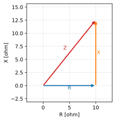

# RLC直列回路の電流

## 問題

正弦波交流電源(実効値 100 V、周波数 50 Hz)に、抵抗 R = 10 Ω、 インダクタンス L = 50 mH、静電容量 C = 1000 µF を直列に接続した。 この回路に流れる電流の実効値 I[A] を求めよ。

*図1 インピーダンス三角形(R, X = XL − XC, Z)*

## 解答

1. $X_L = 2\pi f L = 15.71$ Ω(誘導性リアクタンス)
2. $X_C = \dfrac{1}{2\pi f C} = 3.18$ Ω(容量性リアクタンス)
3. $X = X_L - X_C = 12.52$ Ω
4. $Z = \sqrt{R^2 + X^2} = 16.03$ Ω
5. $I = \dfrac{V}{Z} =$ 6.24 A

> [!success] 答え
> 6.24 A

## 採点基準

| 観点 | 配点 |
|---|---|
| XL = 2πfL, XC = 1/(2πfC) の立式 | 4 |
| 合成リアクタンス X = XL − XC とインピーダンス Z = √(R²+X²) | 5 |
| 電流 I = V/Z の計算 | 3 |
| 有効数字・単位(A) | 2 |
| **合計** | **14** |

## 解説

誘導性リアクタンス XL = 2πfL、容量性リアクタンス XC = 1/(2πfC)、 合成リアクタンスは X = XL − XC である。インピーダンスは Z = √(R² + X²)、 電流は I = V/Z で求まる。本問では I = 6.24 A となる。

## よくある誤り

- **容量性リアクタンスを引き忘れ**: 5.37 A — X = XL − XC を使う
- **リアクタンスを加算してしまう**: 4.68 A — 直列では X = XL − XC(差)
